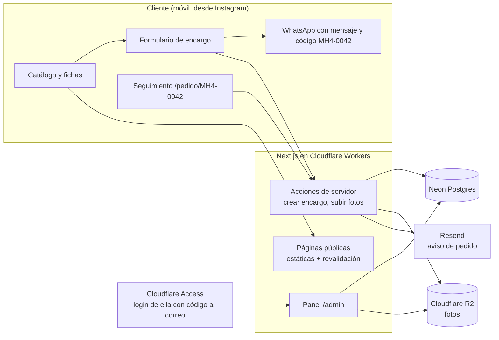

# Arquitectura

Objetivo: una web rápida en móvil (sus clientes llegan desde Instagram), barata de mantener y con un
panel que ella pueda usar sola desde el celular.

## Vista general



## Decisiones

| Tema | Decisión | Por qué |
|---|---|---|
| Framework | **Next.js 16** (App Router) | Lo dominas (axchisan.com); páginas estáticas para el catálogo y acciones de servidor para encargos y panel en un solo proyecto |
| Hosting | **Cloudflare Workers** con OpenNext | El plan gratuito de Vercel prohíbe el uso comercial ([fuente](https://justinmckelvey.com/blog/is-vercel-free)); Workers de pago cuesta 5 USD/mes y el plan gratuito sirve para la demo si cabe en 3 MB |
| Base de datos | **Neon Postgres** (Drizzle ORM) | Ya tienes cuenta; el plan gratuito sobra para este volumen; ramas para probar cambios |
| Fotos | **Cloudflare R2** | 10 GB gratis y sin coste de salida; subida directa desde el navegador con URL firmada |
| Variantes de imagen | Se generan en el navegador antes de subir (400, 800 y 1600 px, WebP) | Evita pagar transformaciones; el panel lo hace solo |
| Login del panel | **Cloudflare Access** con código de un solo uso al correo de ella | Cero código de autenticación, gratis hasta 50 usuarios ([fuente](https://www.cloudflare.com/zero-trust/products/access/)); ella solo pone su correo |
| Avisos | **Resend** desde el dominio de la tienda | Correo a ella cuando llega un encargo; plan gratuito suficiente |
| WhatsApp | Enlace `wa.me` con mensaje prellenado | Gratis, funciona con su WhatsApp actual; no hace falta la API de Meta |
| Pagos | Transferencia (como hoy). Opcional: enlaces de pago Wompi para el anticipo | No obliga a cambiar cómo cobra |
| Estilos | CSS con los tokens de `recursos/marca/tokens.css` | Marca coherente con la hoja de marca |

## Páginas

**Públicas**

| Ruta | Contenido |
|---|---|
| `/` | Portada: hero con producto estrella, categorías, destacados, "Hecho en Vélez", clientes, cómo comprar |
| `/catalogo` y `/catalogo/[categoria]` | Rejilla filtrable (categoría, ocasión, personalizable, entrega inmediata) |
| `/p/[slug]` | Ficha: galería, descripción, tamaño, plazo, personalización, precio si lo hay, botones de encargo y WhatsApp |
| `/encargo` | Formulario de encargo personalizado (con fotos de referencia) |
| `/pedido/[codigo]` | Seguimiento (código + últimos 4 dígitos del teléfono) |
| `/como-comprar` | Plazos, anticipo, cuotas, urgencia, envíos, devoluciones, preguntas frecuentes |
| `/sobre-mi` | Su historia, el proceso (fotogramas del reel) y Vélez |

**Panel (`/admin`, detrás de Cloudflare Access)**

| Sección | Qué hace ella |
|---|---|
| Pedidos | Ver encargos nuevos, cotizar, cambiar estado, registrar anticipo y saldo, fecha estimada |
| Productos | Crear/editar productos, subir y ordenar fotos, marcar destacado o agotado |
| Clientes | Historial por cliente (se crea solo con cada encargo) |
| Ajustes | Agenda abierta/cerrada y su mensaje, WhatsApp, textos de "Cómo comprar", datos de pago privados |

## Modelo de datos

```
categoria(id, slug, nombre, orden)
producto(id, slug, categoria_id, nombre, descripcion, personalizacion[], tamano, plazo_dias,
         precio_desde NULL, entrega_inmediata, destacado, activo, orden, creado, actualizado)
foto(id, producto_id, clave_r2, alt, orden, ancho, alto)
cliente(id, nombre, whatsapp, ciudad, notas, creado)
pedido(id, codigo 'MH4-0042', cliente_id, producto_id NULL, detalle jsonb, fotos_referencia[],
       estado, total NULL, anticipo NULL, cuotas, urgente, fecha_estimada NULL, creado)
pedido_evento(id, pedido_id, estado, nota, creado)        -- historial visible en seguimiento
testimonio(id, texto, nombre_publico, foto_clave NULL, autorizado, orden)
ajustes(clave, valor jsonb)                                -- agenda, whatsapp, textos, datos de pago
```

Estados del pedido: `solicitud → cotizado → anticipo_recibido → en_proceso → listo → enviado → entregado`
(+ `cancelado`). Los datos semilla salen de `recursos/catalogo/catalogo.json`.

## Seguridad y privacidad

- Los datos bancarios viven en `ajustes` y solo se muestran en un pedido ya cotizado.
- La página de seguimiento pide código + 4 dígitos del teléfono; no expone datos del cliente.
- Subidas a R2 solo con URL firmada de corta duración, tipos de imagen y tamaño máximo.
- Formulario de encargo con Cloudflare Turnstile contra spam.
- La demo lleva `noindex` y va protegida (ver `07-plan-demo.md`).
