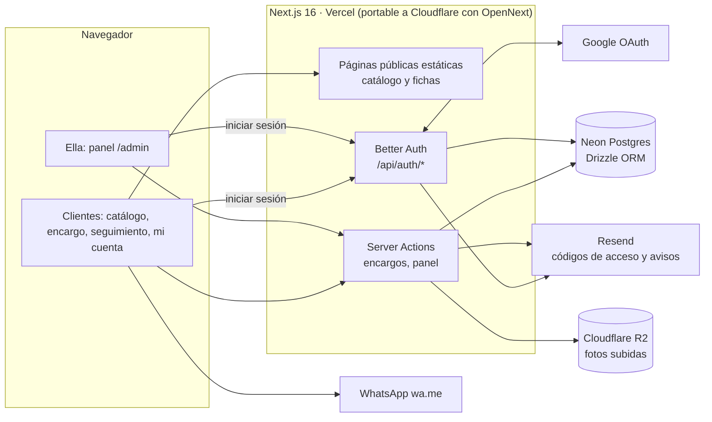

# Arquitectura

Objetivo: una web rápida en móvil (sus clientes llegan desde Instagram), barata de mantener, con un
panel que ella pueda usar sola desde el celular y **portable**: hoy vive en un subdominio tuyo
(`magichands.axchisan.com`) y mañana en el dominio de ella sin tocar código.

Estado al 1 de octubre de 2026: la parte pública está construida y publicada (ver
`08-plan-de-desarrollo.md`). Login, base de datos y panel están diseñados aquí y pendientes.

## Vista general



## Decisiones

| Tema | Decisión | Por qué |
|---|---|---|
| Framework | **Next.js 16** (App Router) | Ya construido; páginas estáticas para el catálogo y acciones de servidor para encargos y panel |
| Hosting de la demo | **Vercel** (proyecto `magichands`, conectado a GitHub `axchisan/magichands`) | Cada `git push` a `main` publica; cada rama/PR tiene vista previa |
| Hosting en producción | A decidir al vender: Cloudflare Workers (gratis, ya probado con OpenNext) o Vercel Pro | Vercel Hobby no permite uso comercial (ver `06`) |
| **Login** | **Better Auth** dentro de la propia app (no un servicio externo) | Es "el login de la propia página"; portable entre dominios y hostings; soporta Google, códigos por correo y roles |
| Métodos de acceso | **Google** y **código de un solo uso por correo** (sin contraseñas) | Lo más fácil para clientas en el celular; nada que recordar ni filtrar |
| Roles | `admin` (ella y tú) y `cliente` | El panel solo para `admin`; los admin se definen por correo en `ADMIN_EMAILS` |
| Base de datos | **Neon Postgres** + **Drizzle ORM** | Ya tienes cuenta; plan gratuito suficiente; ramas para probar migraciones |
| Fotos subidas | **Cloudflare R2** (API S3, URL firmada) | 10 GB gratis, sin coste de salida, funciona igual en Vercel o Cloudflare |
| Fotos del catálogo actual | Estáticas en `web/public/img` (WebP 480/960/1440) | Ya existen; al crear productos desde el panel, las nuevas van a R2 con las mismas 3 variantes |
| Correos | **Resend** (códigos de acceso y aviso de encargo nuevo) | Dominio `axchisan.com` ya verificado; remitente configurable por variable |
| WhatsApp | Enlace `wa.me/573115685168` con mensaje prellenado | Sigue siendo el canal de cierre; no hace falta la API de Meta |
| Pagos | Transferencia (como hoy). Pasarela = extra cotizado aparte | Fuera del paquete base de $300.000 |
| Estilos | CSS Modules + tokens de `recursos/marca/tokens.css` | Ya implementado |

## Login: cómo funciona

- **Clientes** (opcional, nunca obligatorio para encargar): pueden entrar con Google o con un código
  que les llega al correo. Con sesión, el encargo se guarda en la base de datos y ven sus pedidos en
  `/mi-cuenta` sin código ni dígitos del celular.
- **Ella (admin)**: entra igual (Google o código). Si su correo está en `ADMIN_EMAILS`, la sesión tiene
  rol `admin` y ve `/admin`. Tú también estás en la lista mientras des soporte.
- **Rutas**: `/entrar` (pantalla de acceso), `/api/auth/[...all]` (Better Auth), `/mi-cuenta`,
  `/admin/*`. La protección se hace en el servidor (cada página y acción del panel comprueba la sesión y
  el rol); el `proxy.ts` solo redirige a `/entrar` como comodidad.
- **Sesiones**: cookie `HttpOnly`, `Secure`, `SameSite=Lax`, solo del host (sin atributo `Domain`), para
  que funcione igual en `magichands.axchisan.com`, en `*.vercel.app` y en el dominio de ella.

## Portabilidad de dominio

Todo lo que depende del dominio sale de variables de entorno; cambiar de dominio es cambiar variables y
añadir una URL de redirección en Google. Lista completa en `09-dominio-portable.md`.

| Variable | Hoy | Con su dominio |
|---|---|---|
| `NEXT_PUBLIC_SITE_URL` | `https://magichands.axchisan.com` | `https://magich4nds.com` |
| `BETTER_AUTH_URL` | igual que la anterior | igual que la anterior |
| `BETTER_AUTH_TRUSTED_ORIGINS` | subdominio + `*.vercel.app` del proyecto + `localhost:3000` | se añade el nuevo dominio |
| `EMAIL_FROM` | `Magic H4nds <magichands@axchisan.com>` | `Magic H4nds <hola@magich4nds.com>` |
| `ADMIN_EMAILS` | tu correo + el de ella | igual |

## Páginas

**Públicas (construidas)**: `/`, `/catalogo`, `/catalogo/[categoria]`, `/p/[slug]`, `/encargo`,
`/pedido`, `/como-comprar`, `/sobre-mi`, 404.

**Con login (pendientes)**: `/entrar`, `/mi-cuenta`, `/admin` (resumen), `/admin/pedidos`,
`/admin/pedidos/[codigo]`, `/admin/productos`, `/admin/productos/[slug]`, `/admin/clientes`,
`/admin/ajustes`.

## Modelo de datos

Tablas de Better Auth (las genera su CLI): `user` (+ campo `role`), `session`, `account`, `verification`.

Tablas del negocio:

```
categoria(id, slug, nombre, descripcion, orden)
producto(id, slug, categoria_id, nombre, descripcion, personalizacion text[], tamano, plazo,
         precio_referencia jsonb NULL, precio_confirmado int NULL, destacado, activo, orden,
         creado, actualizado)
foto(id, producto_id, clave, alt, orden, ancho, alto, origen 'estatica'|'r2', mejorada_ia)
cliente(id, user_id NULL, nombre, whatsapp, ciudad, notas, creado)      -- se crea con el primer encargo
pedido(id, codigo 'MH4-XXXX', cliente_id, producto_id NULL, detalle jsonb, fotos_referencia text[],
       estado, total NULL, anticipo NULL, cuotas, urgente, fecha_deseada NULL, fecha_estimada NULL, creado)
pedido_evento(id, pedido_id, estado, nota, creado)                       -- historial del seguimiento
ajustes(clave, valor jsonb)    -- agenda abierta/cerrada y mensaje, textos, mostrar precios, datos de pago privados
```

Estados del pedido: `solicitud → cotizado → anticipo_recibido → en_proceso → listo → enviado → entregado`
(+ `cancelado`). Los datos semilla salen de `web/src/data/catalogo.json`.

## Seguridad y privacidad

- Panel y acciones de escritura: comprobación de sesión y rol en el servidor en **cada** acción.
- Datos bancarios solo en `ajustes`, visibles para el cliente únicamente en su pedido ya cotizado.
- Seguimiento sin login: código + 4 últimos dígitos del celular (como ahora).
- Subidas a R2 con URL firmada de corta duración, solo imágenes y con tamaño máximo.
- Formulario de encargo con límite de envíos por IP y Turnstile si aparece spam.
- Secretos solo en variables de entorno de Vercel; nunca en el repositorio.
- Mientras sea demo: `noindex` y aviso en el pie (`NEXT_PUBLIC_DEMO=1`).
